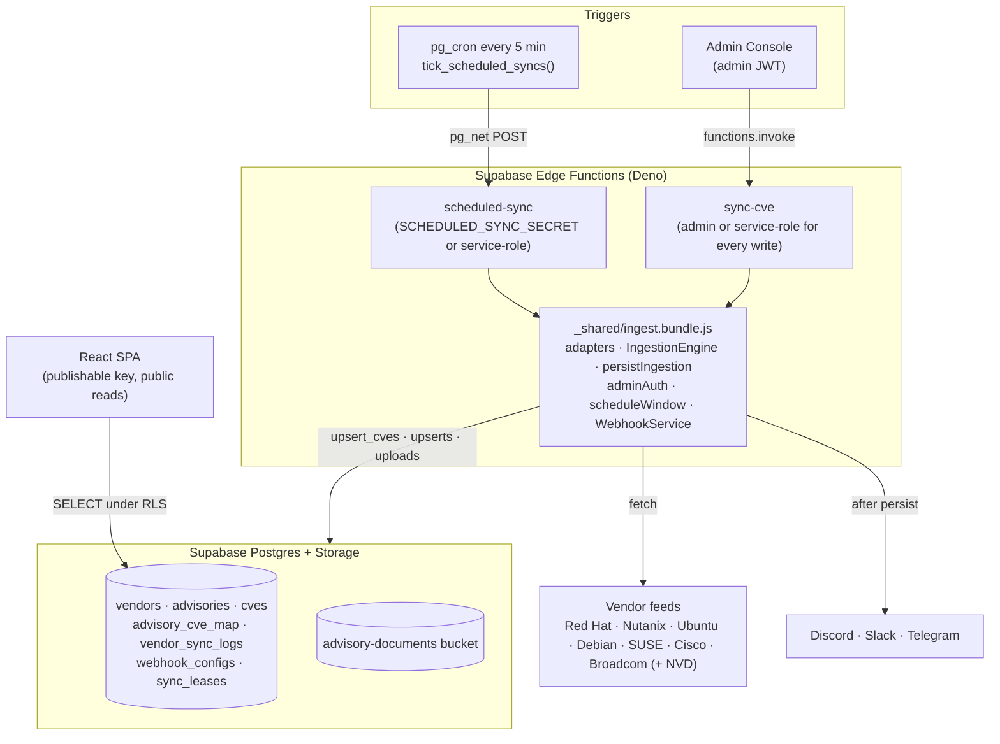

# System Architecture

## 1. Summary

VulnBeacon (repo `vuln-beacon`) collects security advisories from seven vendors and normalises them into advisories, CVEs and product impacts. It stores them in Supabase, sends webhook alerts for new CVEs, and serves a React dashboard for exploring them. Functional detail is in `SPEC.md`, and per-feature designs are in `specs/`.

## 2. Components

## 3. Key Design Decisions

* **One ingestion codebase.** Adapters, the engine, persistence and the admin check live in `src/` and are bundled into `ingest.bundle.js` by `npm run build:edge`. The Edge Functions import that bundle and never carry their own copy. Rebuild and commit the bundle whenever those sources change.
* **Browser never writes tables.** Every write goes through `sync-cve` or `scheduled-sync` with the service-role key. RLS grants the browser read access to public data only.
* **Admin is an explicit grant.** Being signed in is not enough: the account needs `app_metadata.role = 'admin'`. The same check (`src/lib/adminAuth.ts`) runs in the browser and in `sync-cve`.
* **CVE rows merge across vendors.** `upsert_cves()` keeps the strongest score and severity and never erases a value, so the stored CVE does not depend on sync order.
* **Alert after persist.** The engine queues alerts; callers dispatch them only after the run is stored, so a failed write cannot cause duplicate alerts later.
* **Single sync at a time.** Manual and scheduled runs share a `sync_leases` row with a holder id and a 15-minute expiry. An earlier session-level advisory lock leaked across PostgREST's pooled connections; the lease replaces it.
* **Documents off-table.** Full advisory documents go to Storage to keep Postgres small. Product impacts are still stored once per advisory-CVE pair (BUG-006).

## 4. Known Limits

* The Explorer, Dashboard and Vendor pages load every advisory and CVE with its impacts on page load. That is acceptable at current volume; see the open item in `TASK.md`.
* Vendors seeded without adapters (`dell`, `hpe`, `netapp`, `veeam`, `cohesity`) are not synced.
* There is no triage workflow (`cve_triage` is unused).
* Accepted risks are tracked in `BUG_FIX.md`.
