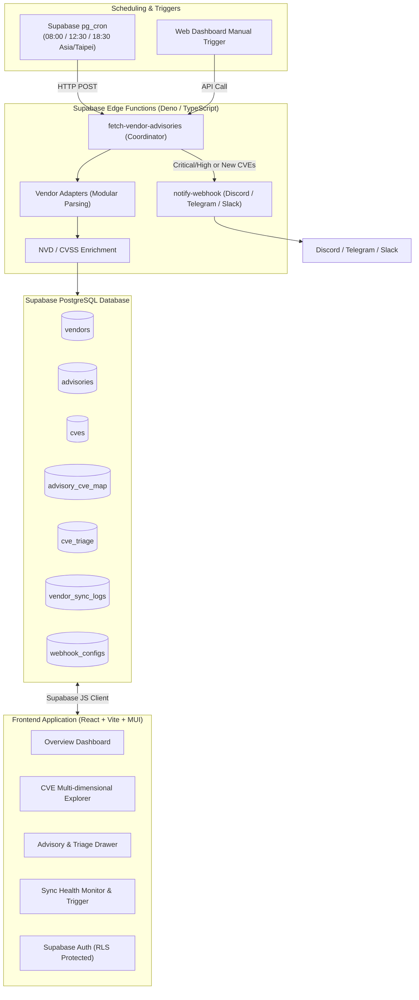

# System Architecture and Implementation Plan

## 1. Executive Summary

`cve-collector` is an automated multi-vendor CVE intelligence and vulnerability triage management platform. It periodically collects security advisories from 8 enterprise IT/infrastructure vendors, normalizes advisory data and CVE records, enriches them with CVSS ratings and exploit status, sends automated alerts via Webhooks (Discord, Telegram, Slack), and provides a React + Vite + Material UI web dashboard for visualization and operational triage.

## 2. Supported Vendors and Ingestion Strategy

| Vendor | Data Source Type | Ingestion Mechanism | Key Entity IDs |
| :--- | :--- | :--- | :--- |
| **RedHat** | Official REST API / CSAF | Red Hat Security Data API (`hydra/rest/securitydata/cve.json`) | `RHSA-*`, `RHBA-*`, `CVE-*` |
| **VMware** | Broadcom Portal API / RSS | Broadcom Security Advisories Feed & JSON Parser | `VMSA-*`, `CVE-*` |
| **Nutanix** | Advisories Portal / RSS | Nutanix Support Advisories RSS & Schema Extractor | `NTNX-SA-*`, `CVE-*` |
| **Dell** | Dell Security Advisories (DSA) | CSAF / RSS Parser | `DSA-*`, `CVE-*` |
| **HPE** | Product Security Bulletins | Security Bulletin RSS Feed & Parser | `HPESB*`, `CVE-*` |
| **NetApp** | Advisories JSON API | `security.netapp.com/data/advisories.json` endpoint | `NTAP-*`, `CVE-*` |
| **Veeam** | Security KB & RSS | Veeam KB articles / RSS Parser | `KB*`, `CVE-*` |
| **Cohesity & NetBackup** | Vendor Bulletins / RSS | Cohesity Advisories & Veritas NetBackup Security RSS | `CVE-*`, `VTS*` |

## 3. System Architecture

## 4. Database Schema Structure

* `vendors`: Master registry of supported vendors (code, name, icon, status).
* `advisories`: Original vendor security advisory notices (vendor_id, advisory_id, title, severity, published_at, url, payload).
* `cves`: Standard CVE records (cve_id, description, cvss_v3_score, severity, is_known_exploited).
* `advisory_cve_map`: Many-to-many relationship linking advisories to CVEs, including affected products and fixed versions.
* `cve_triage`: Security triage tracking per CVE (status: PENDING, IN_PROGRESS, NOT_AFFECTED, PATCH_REQUIRED, PATCHED, notes, assignees).
* `vendor_sync_logs`: Execution history of daily runs (status, duration, items fetched, error logs).
* `webhook_configs`: Alert destinations (Discord, Telegram, Slack webhook URLs, min severity filters).

## 5. Phased Roadmap

1. **Phase 1: Project Skeleton & Database Architecture**
   * Scaffold React + Vite + MUI frontend project.
   * Define and apply Supabase SQL schema with indexes and RLS policies.
   * Seed initial vendor metadata for 8 vendors.
2. **Phase 2: Ingestion Engine & Vendor Adapters**
   * Implement unified Edge Function coordinator with vendor routing.
   * Implement 8 modular vendor adapters with diffing logic.
   * Implement NVD/CVSS enrichment module and execution logging.
3. **Phase 3: Scheduling & Webhook Notifications**
   * Setup `pg_cron` jobs for 3 daily shifts (08:00, 12:30, 18:30 Asia/Taipei).
   * Implement Webhook alert formatter for Discord, Telegram, and Slack.
4. **Phase 4: Frontend Web Application**
   * Implement Dashboard with metrics, charts, and summary widgets.
   * Implement CVE Explorer with multi-faceted filtering, search, and sorting.
   * Implement Detail View and Triage management interface with Supabase Auth.
   * Implement Sync Health Monitor and Manual Sync trigger.
5. **Phase 5: Verification & End-to-End Testing**
   * Validate all 8 adapters against live feeds.
   * Test webhook notifications and triage workflow.
