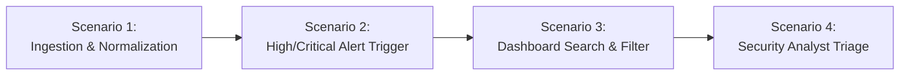

# End-to-End (E2E) Test Plan

## 1. Objectives

End-to-End testing verifies the complete functional flow of `cve-collector` from raw vendor data ingestion, database normalization, automated webhook notification dispatch, to user interaction in the React + Material UI web dashboard.

---

## 2. Core E2E Scenarios



### Scenario 1: Multi-Vendor Ingestion & Data Persistence
- **Flow**:
  1. Trigger coordinator ingestion runner for RedHat, VMware, Nutanix, Dell, HPE, NetApp, Veeam, Cohesity/NetBackup.
  2. Adapter processes mock vendor payloads.
  3. Verify `advisories` records inserted with proper `vendor_id`.
  4. Verify `cves` records created and enriched with CVSS scores.
  5. Verify many-to-many `advisory_cve_map` links created.
  6. Verify execution log recorded in `vendor_sync_logs`.

### Scenario 2: Webhook Alert Dispatch on Critical Vulnerability
- **Flow**:
  1. Ingest simulated Critical Advisory with CVSS 9.8 (e.g., `VMSA-2024-0001` / `CVE-2024-1234`).
  2. Webhook notification engine triggers for Discord, Telegram, and Slack.
  3. Verify message payload contains vendor name, advisory ID, CVE ID, severity chip, and dashboard triage link.
  4. Verify Low/Medium vulnerabilities are filtered out when minimum severity is configured to `HIGH`.

### Scenario 3: Dashboard Discovery & Multi-Faceted Exploration
- **Flow**:
  1. Load React Dashboard.
  2. Overview metrics display total CVEs, Critical count, and Triage Pending count.
  3. Enter search term (e.g. `ESXi` or `CVE-2024`) in CVE Explorer.
  4. Filter by Vendor (`vmware`) and Severity (`CRITICAL`).
  5. Verify table filters correctly and displays relevant records.

### Scenario 4: Analyst Triage Lifecycle & Audit Trail
- **Flow**:
  1. Analyst clicks on a CVE row in the CVE Explorer.
  2. Advisory detail drawer opens showing affected products and vendor links.
  3. Analyst selects status `PATCH_REQUIRED`, assigns to an engineer, and adds triage notes.
  4. Save triage update.
  5. Verify updated triage status is reflected on the CVE table and audit record.

---

## 3. Test Fixtures and Test Environment

- Fixtures reside in `tests/fixtures/`:
  - `redhat/sample-advisory.json`
  - `vmware/sample-vmsa.json`
  - `nutanix/sample-security-advisory.json`
  - `dell/sample-dsa.json`
  - `hpe/sample-hpesb.xml`
  - `netapp/sample-advisory.json`
  - `veeam/sample-kb.json`
  - `cohesity/sample-bulletin.json`

---

## 4. Execution Commands

```bash
# Run all E2E integration suites
npm run test:e2e
```
