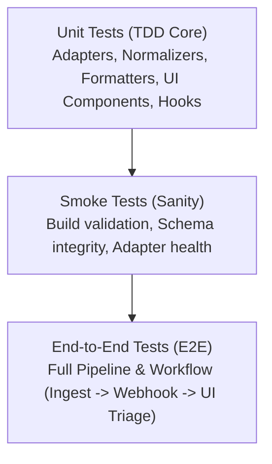

# Testing Framework & Strategy Guide

## 1. Overview & Testing Philosophy

`cve-collector` (VulnBeacon) implements strict **Test-Driven Development (TDD)** across all components:
- **Edge Ingestion & Adapters**: Modular parsers for 8 enterprise vendors, CVSS enrichment, and webhook notification formatters.
- **Database Layer**: PostgreSQL migrations, RLS policies, constraints, and trigger functions.
- **Frontend Dashboard**: React + Vite + TypeScript + Material UI interactive triage interface.

Every new feature, bug fix, or adapter enhancement MUST follow the **Red -> Green -> Refactor** lifecycle. Code contributions without corresponding tests are rejected by quality gates.

---

## 2. Test Pyramid & Scope



| Test Type | Scope | Tools / Framework | Execution Speed |
| :--- | :--- | :--- | :--- |
| **Unit Tests** | Vendor parsers, CVSS calculators, webhook payload formatters, React UI components, custom hooks, utils | Vitest, React Testing Library, jsdom | Fast (< 5s) |
| **Smoke Tests** | Build artifacts, DB schema syntax, environment configs, critical path health checks | Vitest / Custom runners | Fast (< 10s) |
| **E2E Tests** | End-to-end user flows, multi-vendor ingestion to triage state updates, webhook alert dispatch | Vitest / Playwright | Moderate (< 30s) |

---

## 3. Directory Layout

```
docs/test/
├── README.md               # Testing overview, quick start, and command reference
├── TDD_GUIDELINES.md       # Step-by-step TDD protocols and coding standards
├── UNIT_TEST_PLAN.md       # Detailed unit test specifications and coverage requirements
├── SMOKE_TEST_PLAN.md      # Smoke test matrix and sanity check criteria
└── E2E_TEST_PLAN.md        # End-to-end scenarios, verification flows, and fixtures

tests/
├── unit/                   # Unit test suites (adapters, formatters, UI, state)
│   ├── adapters/           # Unit tests for each of the 8 vendor adapters
│   ├── formatters/         # Unit tests for Discord, Telegram, and Slack webhook formatters
│   ├── enrichment/         # Unit tests for CVSS and NVD enrichment helpers
│   └── components/         # Frontend React component and hook tests
├── smoke/                  # Smoke tests for build, migrations, and health
│   ├── build.smoke.test.ts
│   ├── schema.smoke.test.ts
│   └── adapters.smoke.test.ts
├── e2e/                    # E2E integration scenarios
│   ├── ingestion-flow.e2e.test.ts
│   ├── triage-workflow.e2e.test.ts
│   └── webhook-dispatch.e2e.test.ts
└── fixtures/               # Sample vendor feed payloads & mock responses
    ├── redhat/
    ├── vmware/
    ├── nutanix/
    ├── dell/
    ├── hpe/
    ├── netapp/
    ├── veeam/
    └── cohesity/
```

---

## 4. Test Commands Reference

All test commands can be executed directly inside `src/` or via `--prefix src` from the repository root:

```bash
# Run all tests (Unit + Smoke + E2E)
npm --prefix src test

# Run only unit tests
npm --prefix src run test:unit

# Run unit tests in watch mode (ideal for TDD)
npm --prefix src run test:watch

# Run unit test coverage report
npm --prefix src run test:coverage

# Run smoke tests (Sanity & build checks)
npm --prefix src run test:smoke

# Run End-to-End integration tests
npm --prefix src run test:e2e

# Run production build
npm --prefix src run build
```

---

## 5. Quality Standards & Coverage Thresholds

| Metric | Minimum Target | Critical Modules Target |
| :--- | :--- | :--- |
| **Statement Coverage** | ≥ 85% | ≥ 95% (Adapters & Formatters) |
| **Branch Coverage** | ≥ 80% | ≥ 90% (CVSS & Severity mapping) |
| **Function Coverage** | ≥ 85% | ≥ 95% |
| **Line Coverage** | ≥ 85% | ≥ 95% |

Refer to [TDD_GUIDELINES.md](file:///root/dev/vuln-beacon/docs/test/TDD_GUIDELINES.md) for step-by-step TDD workflows.
