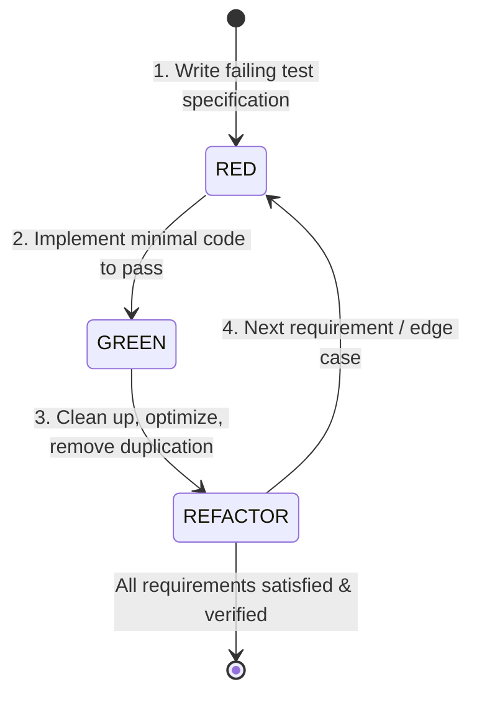

# Test-Driven Development (TDD) Guidelines

## 1. Core Principles

Test-Driven Development (TDD) is non-negotiable in this project. All modules (Edge functions, adapters, data mappers, React components, and state stores) must adhere to the three laws of TDD:

1. **You must write a failing test before writing any production code.**
2. **You must write only enough test code to demonstrate a failure (compilation failure counts).**
3. **You must write only enough production code to make the failing test pass.**

---

## 2. Red-Green-Refactor Lifecycle



### Step 1: RED Phase
- Create or update the test file under `tests/unit/`, `tests/smoke/`, or `tests/e2e/`.
- Specify the desired behavior using standard BDD syntax (`describe`, `it`, `expect`).
- Run the test runner:
  ```bash
  npm run test:unit -- path/to/test.ts
  ```
- **Verify that the test fails for the expected reason** (e.g. missing function, incorrect return value, uncaught error).

### Step 2: GREEN Phase
- Implement the simplest valid code that satisfies the test condition.
- Avoid premature optimizations or speculative abstractions.
- Run tests and confirm:
  ```bash
  npm test
  ```
- All tests must pass cleanly.

### Step 3: REFACTOR Phase
- Improve code readability, eliminate redundancy, and ensure strict TypeScript typing.
- Ensure compliance with ASD-STE100 and Clean Code guidelines.
- Re-run all tests to ensure no regressions were introduced.

---

## 3. Mocking & Isolation Standards

1. **Network Calls**:
   - Never perform live HTTP requests inside unit tests.
   - Use mock payloads stored under `tests/fixtures/<vendor>/`.
   - Mock global `fetch` using `vi.fn()` or MSW (Mock Service Worker).

2. **Supabase Client**:
   - Create mock Supabase database responses for unit tests.
   - For integration/E2E tests, use local Supabase test instance or deterministic in-memory mock repositories.

3. **Time / Timers**:
   - Mock system timers via `vi.useFakeTimers()` when testing cron calculations, timeouts, or shift scheduling.

---

## 4. Test Naming Conventions

All test suites follow standard naming patterns:
- Unit tests: `*.test.ts` or `*.test.tsx` in `tests/unit/`
- Smoke tests: `*.smoke.test.ts` in `tests/smoke/`
- E2E tests: `*.e2e.test.ts` in `tests/e2e/`

Test case descriptions must clearly state given condition, action, and expected outcome:
```typescript
describe('RedHatAdapter', () => {
  it('should parse RedHat API advisory payload and extract CVE-2024-XXXX with CRITICAL severity', async () => {
    // Given
    const mockFeed = loadFixture('redhat/cve-2024-sample.json');
    // When
    const result = await redhatAdapter.parse(mockFeed);
    // Then
    expect(result.advisories).toHaveLength(1);
    expect(result.advisories[0].severity).toBe('CRITICAL');
  });
});
```

---

## 5. Verification Gate before Commit

Before finalizing any task or PR, run the full test suite:
```bash
npm run test:coverage
npm run test:smoke
npm run test:e2e
```
Ensure 0 failures, 0 warnings, and coverage thresholds met.
